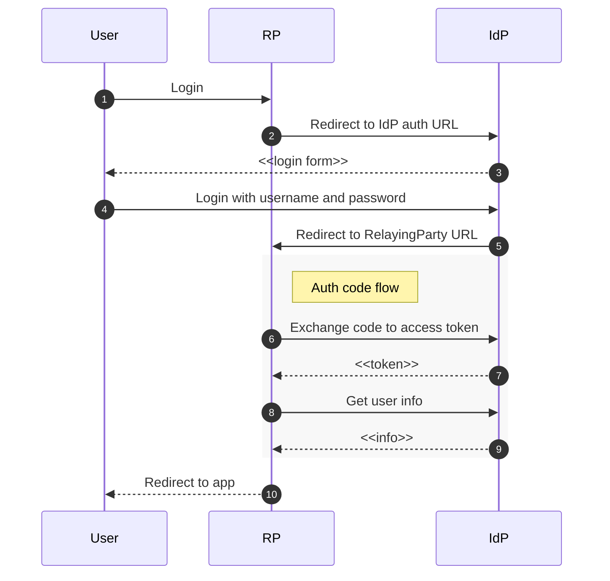
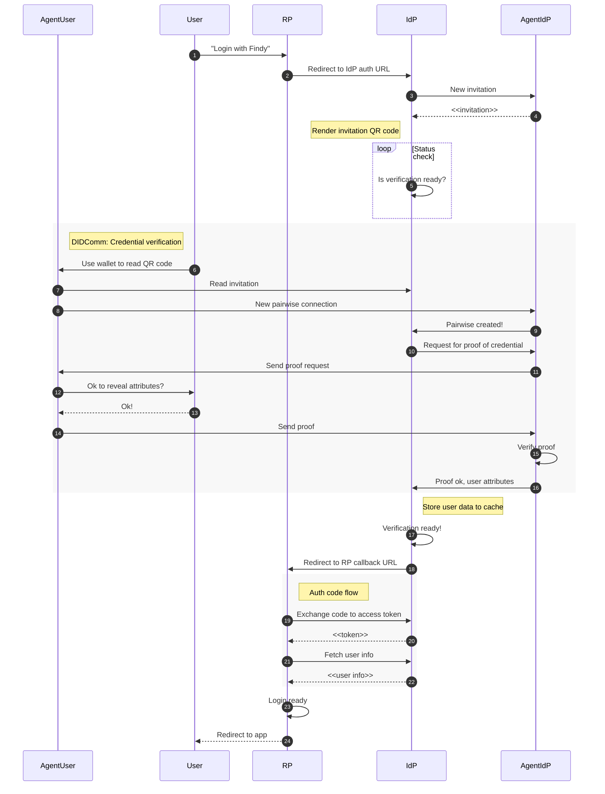

# findy-oidc-provider

Sample PoC project for integrating Aries-agent based authentication to OIDC-provider.

## Basic OIDC login flow

```mermaid
sequenceDiagram
    autonumber
    participant User
    participant RP
    participant IdP

    User->>RP: Login
    RP->>IdP: Redirect to IdP auth URL
    IdP-->>User: <<login form>>
    User->>IdP: Login with username and password
    IdP->>RP: Redirect to RelayingParty URL
    rect rgb(248, 248, 248)
    Note right of RP: Auth code flow
    RP->>IdP: Exchange code to access token
    IdP-->>RP: <<token>>
    RP->>IdP: Get user info
    IdP-->>RP: <<info>>
    end
    RP-->>User: Redirect to app
```

## OIDC login flow with DIDComm

```mermaid
sequenceDiagram
    autonumber
    participant AgentUser
    participant User
    participant RP
    participant IdP
    participant AgentIdP

    User->>RP: "Login with Findy"
    RP->>IdP: Redirect to IdP auth URL
    IdP->>AgentIdP: New invitation
    AgentIdP-->>IdP: <<invitation>>
    Note left of IdP: Render invitation QR code
    loop Status check
        IdP->>IdP: Is verification ready?
    end
    rect rgb(248, 248, 248)
    Note right of AgentUser: DIDComm: Credential verification
    User->>AgentUser: Use wallet to read QR code
    AgentUser->>IdP: Read invitation
    AgentUser->>AgentIdP: New pairwise connection
    AgentIdP->>IdP: Pairwise created!
    IdP->>AgentIdP: Request for proof of credential
    AgentIdP->>AgentUser: Send proof request
    AgentUser->>User: Ok to reveal attributes?
    User-->>AgentUser: Ok!
    AgentUser->>AgentIdP: Send proof
    AgentIdP->>AgentIdP: Verify proof
    AgentIdP->>IdP: Proof ok, user attributes
    end
    Note right of IdP: Store user data to cache
    IdP->>IdP: Verification ready!
    IdP->>RP: Redirect to RP callback URL
    rect rgb(248, 248, 248)
    Note right of RP: Auth code flow
    RP->>IdP: Exchange code to access token
    IdP-->>RP: <<token>>
    RP->>IdP: Fetch user info
    IdP-->>RP: <<user info>>
    end
    RP->>RP: Login ready
    RP-->>User: Redirect to app

```
