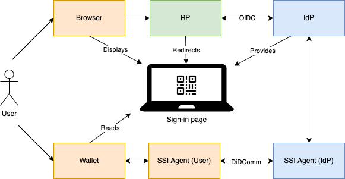
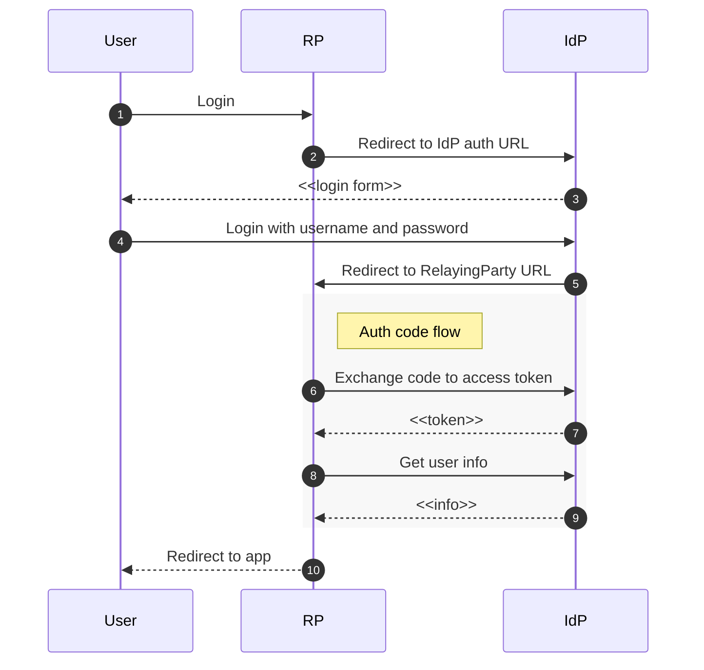
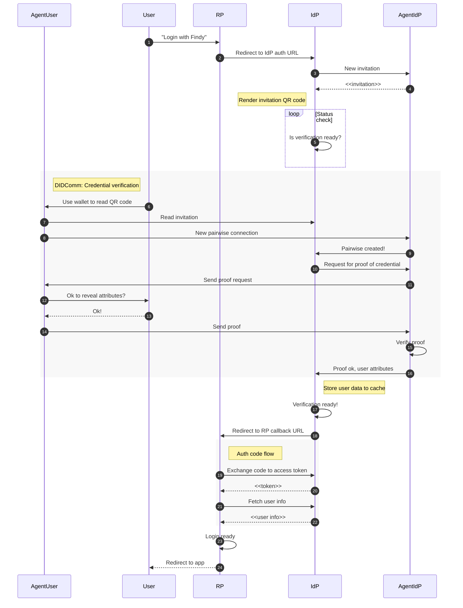

# findy-oidc-provider

[](https://github.com/findy-network/findy-oidc-provider/actions/workflows/test.yml)

Sample PoC project for integrating Aries-agent based authentication to OIDC identity provider. The OIDC provider implementation is [node-oidc-provider](https://github.com/panva/node-oidc-provider) sample code that has been extended with [Findy Agency](https://findy-network.github.io) SSI agent capabilities.

## Overview



## Basic OIDC login flow



## OIDC login flow with DIDComm



## Running

1. Make sure you have Findy Agency running [locally](https://github.com/findy-network/findy-wallet-pwa/tree/dev/tools/env#agency-setup-for-local-development) or in the cloud.

1. Setup node and deps

   ```bash
   nvm use
   npm install

   # generates default clients configuration
   npm run check:clients
   ```

1. Configure client(s). The default client configuration can be found in `src/support/configuration.js`. It matches the local setup for [issuer-tool](https://github.com/findy-network/findy-issuer-tool)

   ```js
   ...
       {
       client_id: "issuer-tool-local",
       client_secret: "superSecretKeyLol",
       grant_types: ["authorization_code"],
       redirect_uris: ["http://localhost:3001/auth/findy"],
       },
   ...
   ```

   If you wish to use other clients, you can add them to file `src/support/clients.js`. Note: this file is excluded from version control.

1. Configure connection to agency. If you are using local agency installation, setting following env vars will do, other settings can use the default values:

   ```bash
   export FINDY_OIDC_AGENCY_PORT="50052"
   export FINDY_OIDC_AGENCY_CERT_PATH="/path/to/findy-wallet-pwa/tools/env/config/cert"
   ```

1. Configure cred def id that the service should use for credential verification:

   ```bash
   export FINDY_OIDC_CRED_DEF_ID="DIDEXAMPLE:1:CL:1234:ftn"
   ```

1. Start service with `npm start`. Generate login URL with your client application. Login page should display the connection invitation QR code.
